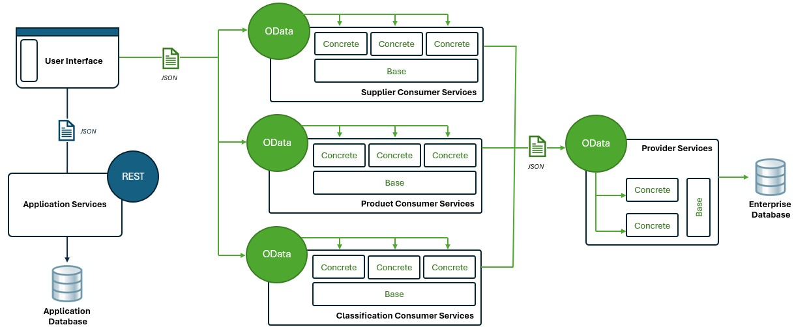

# SWENG861 - Individual Course Project - Product Catalog

This is the final project for the course SWENG861 - Software Construction. I have chosen to develop a service-oriented product catalog application to allow users to navigate, filter, search, display, and select products within an eCommerce-like area.

## Project Motivations and Goals

The motivation of the project is to provide a product catalog perspective to the user to be able to navigate through categories to arrive at product listings, filter records through taxonomy attribute/attribute value selections at any point within navigation, search by keyword terms (descriptions, definitions, attribute and referential values), display the product and its details similar to an online shopping experience, as well as select items to have available within the user's shopping cart for further review.

## Technical approach and methodologies Used

The technical approach that I have been using to develop the user interface has been by starting with static content to understand/finalize the design and then feature-by-feature implementing the necessary logic to have it dynamically available. The technical approach for the consumer service is to define the oData query to the producer web service within Postman and then building out the consumer to parameterize and generate the URL used to invoke the endpoint.

## Architecture & Design

The architecture of this application has characteristics of a distributed monolith as well as microservices as it is a single solution which contains the application and web services but has each domain separate into its own independent consumer web service to be used by the client application. There is no database for persistence within these services, so they just run independently from each other. Behind each of the consumers is a single producer web service which is accessing the enterprise database consisting of all product, supplier, and classification data. All request for any data from the database is accessed through the provider service and the consumers act as a client that specifies the requirements for retrievals. The caching strategy that is being used is to use in-memory cache capabilities of the web services and have it defined at each of the consumer web services. This allows for a single set of cache to be used for all users accessing the product catalog.

## Technical Stack

Technology selected is a Angular front-end web application written in TypeScript, a C# REST Application Web Service, a C# oData Enterprise Provider Web Service, a set of domain-specific C# Enterprise Consumer Services, and a SQL Server Relational Database Management System.
  - Angular Front-End Application - Single Page Application to provide a user interface for accessing the product catalog. It contains both a public (guest) and private (customer) perspective that applies features such as custom pricing for promotional items.
  - C# REST Application Web Service - Service to provide access to persistence layer within a database to application-specific data requirements to support the user interface.
  - C# oData Enterprise Web Service - Service to provide access to all data related to the product catalog inclusive of product, supplier, and customer information. Single service is technical and to be used only by consumer services.
  - C# REST Enterprise Web Services - Set of services to provide access to domain-specific data related to construct the product catalog from the user interface. It is a client service to the producer service.
  - Microsoft SQL Server - Relational Database Management System used to store the database for the application as well as product catalog.

## Future Work and Potential Extensions

If time permits there can be further capabilities around private login customer area to contain some addditional eCommerce features specific to the user's catalogs.

